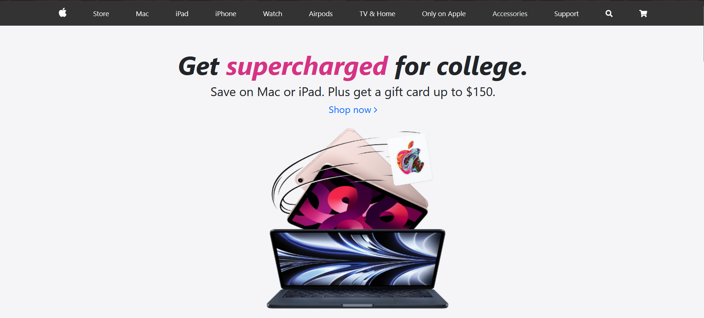
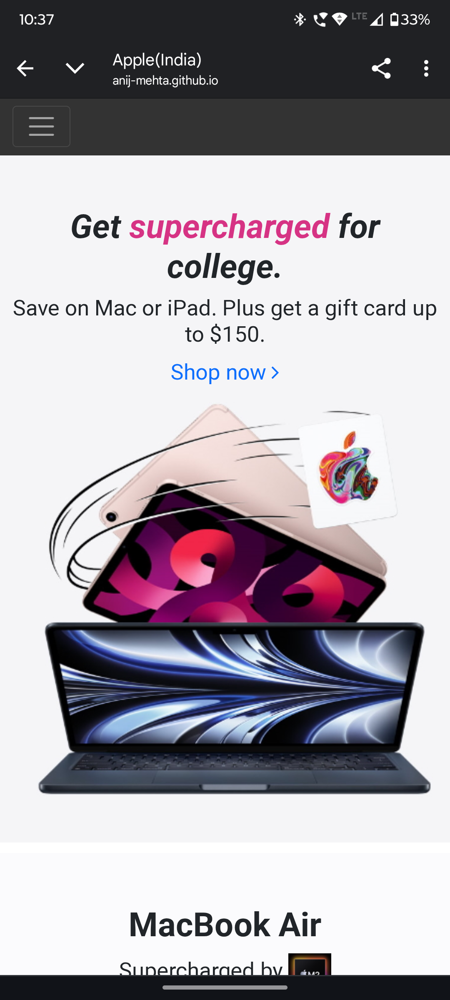

# 🍎 Apple Homepage Clone – Web Dev Project

This is a pixel-perfect clone of the [Apple](https://www.apple.com/in/) homepage, built entirely with HTML and CSS as part of a web development challenge for the **Ncrypt Chenab event**.

---

## 🎯 Objective

To replicate Apple's responsive homepage layout using semantic HTML5 and modern CSS techniques — practicing real-world frontend design principles like:

- Flexbox & Grid layout
- Responsive sections
- Hero banners and product highlights
- Navigation bar mimicking Apple's structure

---

## 🧠 What I Learned

- Precision layout and spacing using Flexbox
- Typography and visual hierarchy inspired by a real-world design
- Use of media queries for mobile responsiveness
- Clean HTML5 semantic structure for accessibility

---

## 💻 Technologies Used

- ✅ HTML5
- ✅ CSS3
- 🧪 [Optional] JavaScript for interactivity (if used)

---

## 🌐 Live Demo

👉 [Click to view live (if hosted)](https://anij-mehta.github.io/ncrypt-chenab-web_dev/)  

---

## 📂 Folder Structure

  ncrypt-chenab-web_dev/ 
├── index.html 
├── style.css 
├── images/ 
│ └── [Apple-like banners, logos, icons] 

---

## 🖼️ Screenshots

| Desktop View | Mobile View |
|--------------|-------------|
|  |  |

---

## ✨ Credits

Design inspiration from [Apple.com](https://www.apple.com/in/)  
Built during **Ncrypt Chenab Web Dev Event**

---

## 📜 License

This project is for educational purposes only. All logos and branding belong to Apple Inc.
